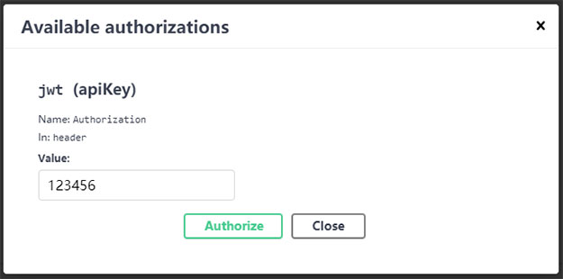
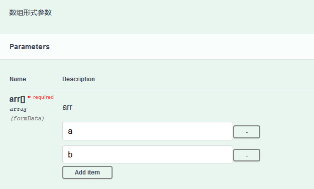

# hyperf-apihelper
hyperf api and swagger helper.   
它是一个[Hyperf](https://github.com/hyperf-cloud/hyperf)框架的 [**api接口自动验证和swagger接口文档生成**] 组件.  
功能包括：  
- 通过注解定义接口路由、请求方法和参数,并由中间件自动校验接口参数.
- 生成json文件,供swagger接口文档测试使用,可打开或关闭.
- swagger支持接口多版本分组管理.
- 支持restful path路由参数校验.
- 支持自定义响应体结构.
- 支持自定义前置动作.
- 支持自定义拦截动作.


### 安装
- nginx(或apache)指定站点目录为 BASE_PATH/public, swagger-ui将自动发布到该目录下
- 安装组件
```sh
# composer安装本组件
composer require kakuilan/hyperf-apihelper

# 发布组件初始化配置文件到你的项目下
php bin/hyperf.php vendor:publish kakuilan/hyperf-apihelper
```


### 配置
- 修改config/autoload/apihelper.php中的配置,将`host`改为你的域名,如test.com,则接口文档地址为test.com/swagger
- 修改config/autoload/middlewares.php中间件配置,如
```php
return [
    'http' => [
        Hyperf\Apihelper\Middleware\ApiValidationMiddleware,
    ],
];
```
- 修改config/autoload/exceptions.php异常处理配置,如
```php
return [
    'handler' => [
        'http' => [
            Hyperf\Apihelper\Exception\Handler\ValidationExceptionHandler::class,
            App\Exception\Handler\AppExceptionHandler::class,
        ],
    ],
];
```
- 修改config/autoload/dependencies.php依赖配置,如
```php
return [
    'dependencies' => [
        Hyperf\HttpServer\Router\DispatcherFactory::class => Hyperf\Apihelper\DispatcherFactory::class
    ],
];
```


### 使用
编辑控制器文件app/Controller/Test.php,如
```php
namespace App\Controller;

use Hyperf\Apihelper\Annotation\ApiController;
use Hyperf\Apihelper\Annotation\ApiResponse;
use Hyperf\Apihelper\Annotation\ApiVersion;
use Hyperf\Apihelper\Annotation\Method\Delete;
use Hyperf\Apihelper\Annotation\Method\Get;
use Hyperf\Apihelper\Annotation\Method\Patch;
use Hyperf\Apihelper\Annotation\Method\Post;
use Hyperf\Apihelper\Annotation\Method\Put;
use Hyperf\Apihelper\Annotation\Param\Body;
use Hyperf\Apihelper\Annotation\Param\File;
use Hyperf\Apihelper\Annotation\Param\Form;
use Hyperf\Apihelper\Annotation\Param\Header;
use Hyperf\Apihelper\Annotation\Param\Path;
use Hyperf\Apihelper\Annotation\Param\Query;
use Hyperf\Apihelper\Controller\BaseController;
use Hyperf\Apihelper\Exception\ValidationException;

/**
 * @ApiController(tag="测试实例", description="测试例子")
 * @ApiVersion(group="v1", description="第一版本")
 */
class Test extends BaseController {

    /**
     * @Get(path="/user", description="获取用户详情")
     * @Query(key="id", rule="required|int|gt:0")
     * @Query(key="u", rule="required|active_url|trim")
     * @Query(key="t", rule="required|starts_with:a")
     * @Query(key="e", rule="required|trim|enum:e,f,g")
     * @Query(key="h", rule="trim|cb_chkHello")
     * @ApiResponse(code=200, schema={"$ref":"Response"})
     */
    public function get() {
        //失败
        //return self::doFail();

        //成功
        return self::doSuccess();
    }


    /**
     * @Patch(path="/info/{id}", description="路由参数测试")
     * @Path(key="id", rule="int|gt:0")
     * @ApiResponse(code=200, schema={"$ref":"Response"})
     */
    public function info() {
        $data = [
            'id' => $this->request->route('id'),
        ];
        return self::doSuccess($data);
    }


    /**
     * 检查输入字段
     * @param mixed $value 字段值
     * @param string $field 字段名
     * @param array $options 参数选项
     * @return array
     */
    public function chkHello($value, string $field, array $options): array {
        $res = [
            true,
            $value,
        ];
        if (!true) {
            $res = [
                false,
                '具体验证失败的信息',
            ];
        }

        return $res;
    }


    /**
     * @Get(description="生成验证码")
     * @Header(key="authorization|访问令牌", rule="required_without_all:access_token")
     * @Query(key="access_token|访问令牌", rule="required_without_all:authorization")
     * @Query(key="len|验证码长度", rule="int|gt:0|max:10|default:6")
     * @Query(key="type|验证码类型", rule="int|default:0|enum:0,1,2,3,4,5")
     * @Query(key="width|图片宽度", rule="int|gt:1|default:100")
     * @Query(key="height|图片高度", rule="int|gt:1|default:30")
     * @ApiResponse(code=200, schema={"$ref":"Response"})
     */
    public function create() {
        $len    = $this->request->query('len');
        $type   = $this->request->query('type');
        $width  = $this->request->query('width');
        $height = $this->request->query('height');

        return self::doSuccess();
    }


    /**
     * @Post(path="/arrparam", description="数组形式参数/多级参数")
     * @Form(key="arr", rule="required|array")
     * @Form(key="row", rule="object")
     * @Form(key="row.name", rule="required|string|trim")
     * @Form(key="row.age", rule="int|gt:0|default:1")
     * @Form(key="row.addr", rule="string|trim")
     * @ApiResponse(code=200, schema={"$ref":"Response"})
     */
    public function arrparam() {
        $post = $this->request->post();
        return self::doSuccess($post);
    }


    /**
     * @Post(path="/test/testbody", description="body测试")
     * @Body(rule="required|json|cb_parseBody")
     * @ApiResponse(code=200, schema={"$ref":"Response"})
     */
    public function testbody() {
        return self::doSuccess(date('Y-m-d H:i:s'));
    }


    /**
     * 自定义解析body数据
     * @param mixed $value 字段值
     * @param string $field 字段名
     * @param array $options 参数选项
     * @return array
     * @throws ValidationException
     */
    public function parseBody($value, string $field, array $options): array {
        $arr = json_decode($value, true);
        $res = [
            true,
            $value,
        ];

        //检查
        //        if (!isset($arr['hello'])) {
        //            $res = [
        //                false,
        //                'body必须包含hello字段',
        //            ];
        //            return $res;
        //        }

        //或者
        if (!isset($arr['world'])) {
            throw new ValidationException('body必须包含world字段');
        }

        return $res;
    }


    /**
     * @Post(path="/test/upload", description="上传测试")
     * @File(key="sec", rule="required|file|size:1000")
     * @File(key="img", rule="file|image")
     * @ApiResponse(code=200, schema={"$ref":"Response"})
     */
    public function upload() {
        $files = $this->request->getUploadedFiles();
        return self::doSuccess($files);
    }


}
```


### 验证规则
- 组件会先执行Hyperf官方规则,详见[hyperf validation](https://hyperf.wiki/#/zh-cn/validation)
- 再执行本组件的验证规则,包括:  
  - 转换器,有
    - default,将参数值设为指定的默认值
    - int/integer,将参数值转换为整型
    - float,将参数值转换为浮点数
    - bool,将参数值转换为布尔型
    - trim,过滤参数值前后空格
    
  - 扩展规则,有
    - safe_password,检查是否安全密码
    - natural,检查是否自然数
    - cnmobile,检查是否中国手机号
    - cncreditno,检查是否中国身份证号
    - enum,检查参数值是否枚举值中的一个
    
  - 控制器验证方法.  
  若需要在控制器中执行比较复杂的逻辑去验证,则可以使用该方式.  
  如上例中的cb_chkHello,规则名以cb_开头,后跟控制器的方法名chkHello.  
  验证方法必须定义接受3个参数:$value, $field, $options;  
  返回结果必须是一个数组:  
  若检查失败,为[false, 'error msg'];若检查通过,为[true, $newValue],$newValue为参数值的新值.  
  形如:
    ```php
    public function fn($value, string $field, array $options): array
    ```


### 默认响应体结构
- 接口操作成功,返回{"status":true,"msg":"success","code":200,"data":[]}
- 接口操作失败,返回{"status":false,"msg":"fail","code":400,"data":[]}
- 自定义响应错误码code,可参考languages/zh_CN/apihelper.php

### 自定义响应体结构
若要自定义响应体结构,可以  
- 首先修改config/autoload/apihelper.php中的base_controller配置,指定基本控制器,如  
```php
'base_controller' => Hyperf\Apihelper\Controller\BaseController::class,
```

- 然后基本控制器需要实现`Hyperf\Apihelper\Controller\ControllerInterface`接口.  
包括以下几个静态方法:  
    - `getResponseSchema(): array`,获取响应体结构
    - `doSuccess($data = [], string $msg = 'success', array $result = []): array`,操作成功时响应
    - `doFail($code = '400', array $trans = []): array`,操作失败时响应
    - `doValidationFail(string $msg = ''): array`,执行验证失败时响应

- 最后,基本控制器作为控制器的父类,所有的控制器必须继承自该类.  
具体可参考`Hyperf\Apihelper\Controller\BaseController`.


### 自定义前置动作  
可以自定义控制器前置方法,每次在具体动作之前执行.  
该功能主要是数据初始化,将自定义的数据存储到request属性中,每次请求后销毁,避免控制器协程间的数据混淆.  
该方法必须严格定义，形如:  
```php
public function initialization(ServerRequestInterface $request): ServerRequestInterface
```
该方法不会中止后续具体动作的执行.  
方法名可以在config/autoload/apihelper.php中的`controller_antecedent`中指定,默认为initialization  
具体可参考`Hyperf\Apihelper\Controller\BaseController`.


### 自定义拦截动作
可以自定义控制器拦截方法,每次在具体动作之前执行.  
该功能主要是执行逻辑检查(如令牌或权限),当不符合要求时,中止后续具体动作的执行.  
该方法必须严格定义,形如:  
```php
public function interceptor(string $controller, string $action, string $route): mixed
```
若该方法返回非空的数组或字符串,则停止执行后续的具体动作.  
方法名可以在config/autoload/apihelper.php中的`controller_intercept`中指定,默认为interceptor  
具体可参考`Hyperf\Apihelper\Controller\BaseController`.


### 校验参数提示
- 配置开发环境提示具体参数错误  
编辑apihelper.php配置,将`show_params_detail_error`设为true,  
接口将显示具体字段验证规则的错误信息,方便前端调试.

- 配置生产环境不提示具体参数错误  
编辑apihelper.php配置,将`show_params_detail_error`设为false,  
接口将隐藏具体字段验证信息,而仅提示"缺少必要的参数,或参数类型错误",减少外部安全攻击的可能.

### 获取验证完的数据
要获取具体参数,在控制器里面直接使用hyperf官方的方法去获取,如
```php
$this->request->header('user-agent');
$this->request->query('len');
$this->request->post();
$this->request->route('id');
$this->request->getUploadedFiles();
```

**注意:所有的参数都已经过校验处理,不再是原始的数据.**  
若校验规则中包含有转换器,接收参数后,已经自动转换,无需再手工转换一次.如  
- 校验规则中有trim,则' hello '会自动转为'hello'.
- 校验规则中有int,则字符串'123'会自动转为整型123.


### swagger生成

1.  api请求方法定义包括 `Get`, `Post`, `Put`, `Patch`, `Delete`
2.  参数定义包括 `Header`, `Query`, `File`, `Form`, `Body`, `Path`
3.  返回结果定义 `ApiResponse` ,json串,如{"status":true,"msg":"success","code":200,"data":[]}
4.  ApiVersion接口版本分组并不影响方法里面的实际绑定路由;它只是把控制器里面的接口,归入到某个swagger文件,以便查看.
5.  生产环境请将配置`output_json`修改为false,关闭swagger.


### 图例
  

  

  

  

  
